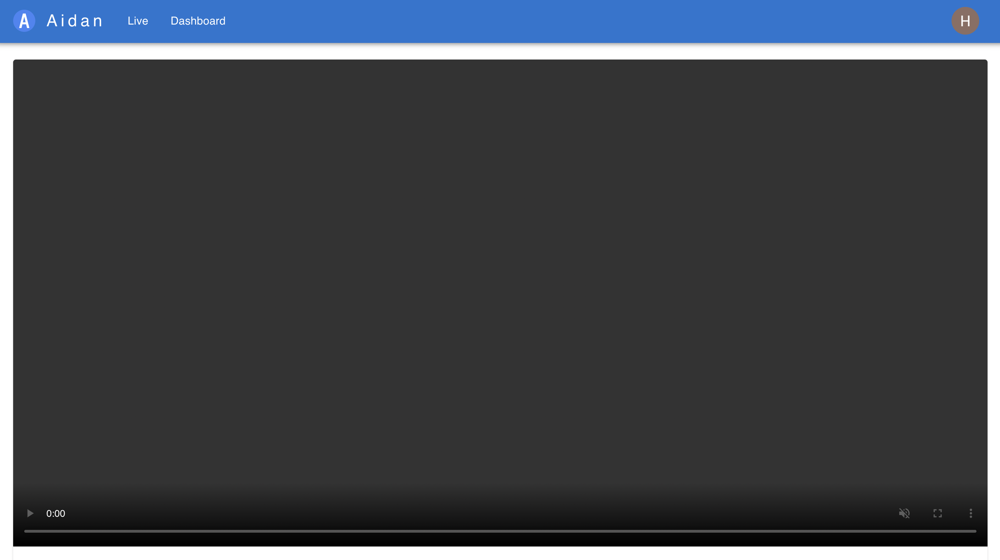

# Aidan

## What is Aidan?

**A**idan **i**s **d**etecting **a**ny **n**eeds.

Aidan is a tool for detecting image classifications captured by Nest Cam.

A typical usage is to detect baby needs, such as diaper change, feeding,
or sleeping. It can act as a smart baby monitor.


## How to use

If you are new to Device Access, please read the [Get Started Guide](https://developers.google.com/nest/device-access/get-started).

After creating a project on [Firebase](https://firebase.google.com/), use the steps below to deploy the sample app.

### Installation

Clone the app:

```shell
git clone https://github.com/hemslo/aidan.git
```

Navigate into project directory:

```shell
cd aidan
```

Link the app with your Firebase project:

```shell
firebase use --add [PROJECT-ID]
```

Update [firebaseConfig.ts](hosting/src/firebaseConfig.ts) with your Firebase project configuration.
[Guide](https://firebase.google.com/docs/web/setup#register-app).

Deploy the app to your Firebase project:

```shell
firebase deploy
```

You can then access the app at your Hosting URL ([https://[PROJECT-ID].web.app](#)).

### Setup

1. Enable Authentication (Email/Password & Google) in your Firebase project. [Doc](https://firebase.google.com/docs/auth).
2. Download the service account key for your Firebase project to `admin/serviceAccountKey.json`. [Doc](https://firebase.google.com/docs/admin/setup#initialize-sdk)
3. Use npm scripts to add users and set claims
    ```shell
   cd admin
   npm install
   npm run addUser EMAIL PASSWORD
   npm run setClaims EMAIL '{"read": "true", "write": "true"}'
    ```
4. Use new account to login
5. Link your Nest Camera to your Firebase project by providing GCP Client Id, Secret and Device Access Project Id.

### Usage

1. Take some snapshots (There is a toggle to enable taking snapshots every 30 seconds)
2. Go to Dashboard (`/dashboard`) to see the results
3. Add some labels
4. Start annotating the snapshots
5. Export image gcs uris and labels to a csv file in BigQuery
6. Create dataset in Google Cloud AutoML Vision
7. Train an edge model
8. Export model as TensorFlow.js
9. Upload model to Firebase Storage `models/latest`
10. Check if new snapshots can be classified automatically

### Taking snapshots from server

If you want to take snapshots from server, you can use aidan-feeder.
It's using puppeteer to take snapshots in a headless Chrome.

1. copy `feeder/.env.sample` to `feeder/.env`
2. set environment variables according to your config
3. use docker image from [ghcr](https://github.com/hemslo/aidan/pkgs/container/aidan-feeder)
4. run container with .env file
    ```shell
   docker run -d --name aidan-feeder --env-file .env ghcr.io/hemslo/aidan-feeder
    ```

## Architecture

```
                 +---------------+     +-----------+
                 | Cloud Storage |  -  | Cloud Run |
                 +---------------+     +-----------+
                         |                   |
+----------+   +------------------+   +-----------+   +----------+   +---------------+
| Nest Cam | - | Firebase Hosting | - | Firestore | - | BigQuery | - | AutoML Vision |
+----------+   +------------------+   +-----------+   +----------+   +---------------+
                         |
                   +-----------+
                   | Puppeteer |
                   +-----------+
```

## Screenshots



